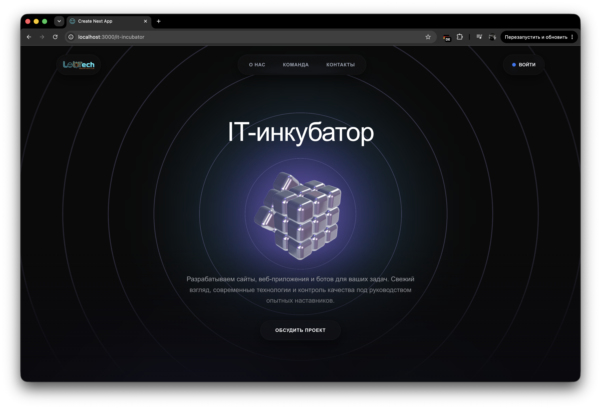
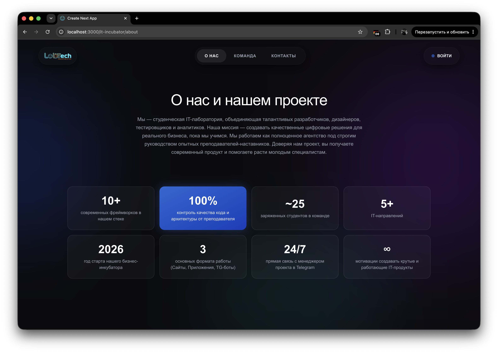
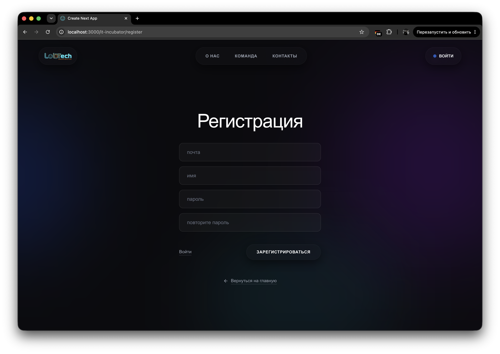
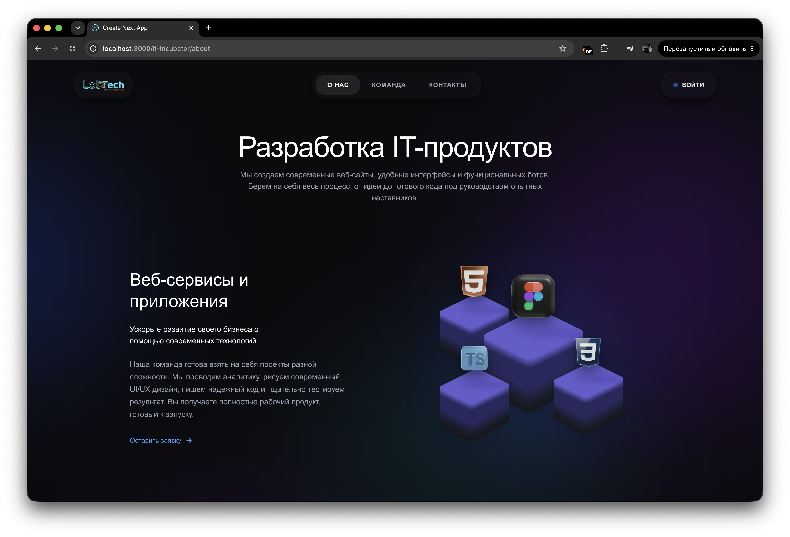

# 🚀 IT-инкубатор | Студенческий IT-хаб

> **IT-инкубатор** — это современная веб-платформа, объединяющая реальный бизнес и талантливых студентов. Система позволяет заказчикам оставлять заявки на разработку IT-продуктов, а студентам — получать опыт работы над коммерческими проектами под руководством опытных менторов.

---

## 📑 Оглавление
- [О проекте](#-о-проекте)
- [Галерея](#-галерея-проекта)
- [Функционал и Роли](#-функционал-и-роли)
- [Бизнес-логика](#-бизнес-логика)
- [Архитектура и Стек](#-архитектура-и-стек-технологий)

---

## 💡 О проекте

Платформа решает задачи автоматизации бизнес-процессов студенческого инкубатора. Основной упор сделан на прозрачное управление статусами проектов, распределение ролей в команде (Frontend, Backend, QA, UI/UX) и строгий контроль доступа (RBAC). 

Вся сложная бюрократия и финансовые обсуждения выведены в Telegram, в то время как платформа служит надежной CRM-системой, трекером состояний и витриной услуг инкубатора.

---

## 📸 Галерея проекта

  
  

  
  

---

## 👥 Функционал и Роли

В системе реализовано 4 уровня доступа:
1. 👤 **Гость:** Просмотр публичных страниц (витрина услуг, команда), регистрация.
2. 💼 **Заказчик (Customer):** Создание заявок (ТЗ, сроки, файлы), отслеживание статуса разработки, связь с менеджером.
3. 👨‍💻 **Студент (Student):** Доступ к профилю со специализацией, просмотр назначенных задач, взаимодействие с командой.
4. 👑 **Менеджер / Админ:** Полное управление проектами, назначение команд (мультиселект студентов), смена статусов заказов (от "Created" до "Done"), управление пользователями.

---

## 🔄 Бизнес-логика (Жизненный цикл заказа)

1. 📝 `created` — Заказчик создал заявку с ТЗ.
2. ⚙️ `taken` — Менеджер связался с клиентом, утвердил детали и назначил команду разработчиков-студентов на проект.
3. 🔍 `testing` — Продукт передан на стадию внутреннего контроля качества (QA).
4. ✅ `done` — Проект успешно сдан заказчику.
5. ❌ `canceled` — Отмена проекта по инициативе любой из сторон.

---

## 🏗 Архитектура и Стек технологий

Бэкенд проекта построен на принципах чистой асинхронной 3-слойной архитектуры:
1. **API Layer (FastAPI):** Обработка запросов, маршрутизация и строгая валидация входящих данных.
2. **Service Layer:** Изолированная бизнес-логика (провайдеры, сервисы авторизации).
3. **Data Access Layer:** Прямое взаимодействие с БД с помощью асинхронных SQL-запросов (без тяжеловесных ORM для максимальной производительности).

### Технологии:
* **Frontend:**
  * **Next.js** (React) — SSR, маршрутизация, SEO.
  * *[Укажите библиотеку стилей, например: Tailwind CSS]*
* **Backend:**
  * **Python 3** (Asyncio).
  * **FastAPI** — высокопроизводительный REST API фреймворк.
  * **Pydantic** — валидация данных и сериализация.
  * **Argon2 (argon2-cffi)** — криптографически стойкое хеширование паролей.
* **База данных:**
  * **PostgreSQL** — основное хранилище. Активное использование продвинутых возможностей СУБД (Custom ENUMs, Array Types, Cascade Deletions).
  * **Psycopg 3** — современный асинхронный драйвер БД.
