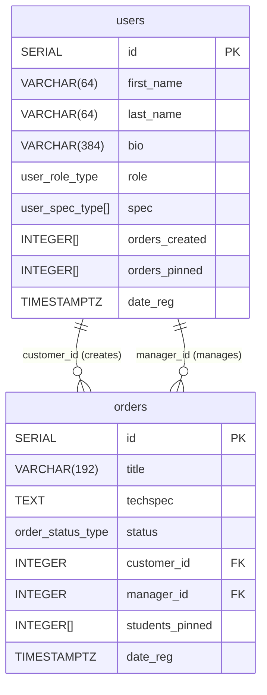

```mermaid
erDiagram
    users {
        SERIAL id PK
        VARCHAR(64) first_name
        VARCHAR(64) last_name
        VARCHAR(384) bio
        user_role_type role
        user_spec_type[] spec
        INTEGER[] orders_created
        INTEGER[] orders_pinned
        TIMESTAMPTZ date_reg
    }

    orders {
        SERIAL id PK
        VARCHAR(192) title
        TEXT techspec
        order_status_type status
        INTEGER customer_id FK
        INTEGER manager_id FK
        INTEGER[] students_pinned
        TIMESTAMPTZ date_reg
    }

    users ||--o{ orders : "customer_id (creates)"
    users ||--o{ orders : "manager_id (manages)"
```
